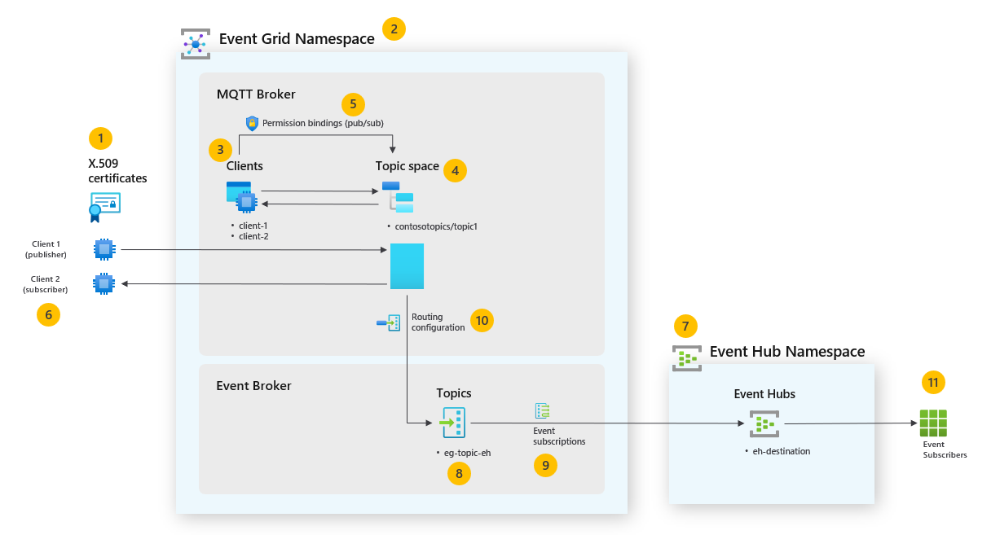

# Event Grid MQTT lab

This lab demonstrates how to use Event Grid with MQTT protocol. The lab uses the Azure CLI and the Mosquitto MQTT client to create a simple scenario where two clients publish and subscribe to events in a topic space. The lab also demonstrates how to route events to an Event Hub.



The several steps in this lab are marked with a number in the above solution diagram and are described in the following sections.

This lab is based on the following documentation:
- [Overview of the MQTT broker feature in Azure Event Grid](https://learn.microsoft.com/en-us/azure/event-grid/mqtt-overview)
- [Quickstart: Publish and subscribe to MQTT messages on an Event Grid namespace with the Azure CLI](https://learn.microsoft.com/en-us/azure/event-grid/mqtt-publish-and-subscribe-cli)
- [Tutorial: Use namespace topics to route MQTT messages to Azure Event Hubs (Azure CLI)](https://learn.microsoft.com/en-us/azure/event-grid/mqtt-routing-to-event-hubs-cli-namespace-topics)


## Step 1. Generate certificates

To create the root and intermediate CA certificates run:

```bash
mkdir ca

export STEPPATH="$PWD/ca"

step ca init \
    --deployment-type standalone \
    --name MqttAppSamplesCA \
    --dns localhost \
    --address 127.0.0.1:443 \
    --provisioner MqttAppSamplesCAProvisioner
```

Follow the cli instructions, when done make sure you remember the password used to protect the private keys, by default the generated certificates and keys are stored in:

```bash
ca/certs/root_ca.crt
ca/certs/intermediate_ca.crt
ca/secrets/root_ca_key
ca/secrets/intermediate_ca_key
```

The CA certs are valid for 10 years.


Create a chain PEM with both root and intermediate CA certificates.

```bash
cat ca/certs/root_ca.crt ca/certs/intermediate_ca.crt > chain_client.pem
```

Use the CA files generated to create a certificate for the first client. Ensure to use the correct path for the cert and secrets files in the command.

```bash
step certificate create client1-authn-ID client1-authn-ID.pem client1-authn-ID.key \
    --ca ca/certs/intermediate_ca.crt \
    --ca-key ca/secrets/intermediate_ca_key \
    --no-password \
    --insecure --not-after 2400h
```

To view the thumbprint, run the Step command:

```bash
step certificate fingerprint client1-authn-ID.pem
```

E.g., thumbprint: `844cd9593bb36c1631982be5d1f9874af2f0a4c9c1772c2e350a00ea2548d440`

Now, create a certificate for the second client.
    
```bash
step certificate create client2-authn-ID client2-authn-ID.pem client2-authn-ID.key \
    --ca ca/certs/intermediate_ca.crt \
    --ca-key ca/secrets/intermediate_ca_key \
    --no-password \
    --insecure --not-after 2400h
```

To view the thumbprint to use with the second client, run the Step command:

```bash
step certificate fingerprint client2-authn-ID.pem
```

E.g., thumbprint: `9af288873242eef8c2cdbe9816316a2666f7894bbe50f69693cf6d2ed4a10c78`


## Step 2. Create a namespace

```bash
RESOURCE_GROUP="eventgrid-mqtt-lab"
EG_NAMESPACE="mqtt-lab-ns"

az group create -n ${RESOURCE_GROUP} -l northeurope
az eventgrid namespace create -g ${RESOURCE_GROUP} -n ${EG_NAMESPACE} --topic-spaces-configuration "{state:Enabled}" --identity "{type:SystemAssigned}"
```


## Step 3. Create clients

Replace the thumbprint with the one generated for the client.

```bash
CLIENT_1_NAME="client-1"
CLIENT_2_NAME="client-2"

az eventgrid namespace client create -g ${RESOURCE_GROUP} --namespace-name ${EG_NAMESPACE} -n ${CLIENT_1_NAME} --authentication-name client1-authnID --client-certificate-authentication "{validationScheme:ThumbprintMatch,allowed-thumbprints:[844cd9593bb36c1631982be5d1f9874af2f0a4c9c1772c2e350a00ea2548d440]}"

az eventgrid namespace client create -g ${RESOURCE_GROUP} --namespace-name ${EG_NAMESPACE} -n ${CLIENT_2_NAME} --authentication-name client2-authnID --client-certificate-authentication "{validationScheme:ThumbprintMatch,allowed-thumbprints:[9af288873242eef8c2cdbe9816316a2666f7894bbe50f69693cf6d2ed4a10c78]}" --attributes "{'room':'345','floor':5}"
```


## Step 4. Create a topic space

```bash
TOPIC_SPACE="tspace01"

az eventgrid namespace topic-space create -g ${RESOURCE_GROUP} --namespace-name ${EG_NAMESPACE} -n ${TOPIC_SPACE} --topic-templates ['contosotopics/topic1']
```


## Step 5. Add permissions

az eventgrid namespace client-group create -g rg --namespace-name name -n client-group --group-query "attributes.floor=6"

Create the permissions binding for publisher and subscriber permissions.

```bash
PERM_PUBLISH="perm-publish"
PERM_SUBSCRIBE="perm-subscribe"

az eventgrid namespace permission-binding create -g ${RESOURCE_GROUP} --namespace-name ${EG_NAMESPACE} -n ${PERM_PUBLISH} --client-group-name '$all' --permission publisher --topic-space-name ${TOPIC_SPACE}
az eventgrid namespace permission-binding create -g ${RESOURCE_GROUP} --namespace-name ${EG_NAMESPACE} -n ${PERM_SUBSCRIBE} --client-group-name '$all' --permission subscriber  --topic-space-name ${TOPIC_SPACE}
```


## Step 6. Test publishing and subscribing

Subscribe to the topic space.

```bash
MQTT_HOSTNAME="mqtt-lab-ns.northeurope-1.ts.eventgrid.azure.net"
TOPIC="contosotopics/topic1"

# Subscribe to the topic
mosquitto_sub -t ${TOPIC} -d -V mqttv5 -h ${MQTT_HOSTNAME} -p 8883 -i client2-authnID -u client2-authnID --cert client2-authn-ID.pem --key client2-authn-ID.key --cafile ca/certs/intermediate_ca.crt --tls-use-os-certs
```

Publish an event to the topic space.

```bash
# Publish to the topic
mosquitto_pub -q 1 -t ${TOPIC} -d -V mqttv5 -m "{\"AssetId\":\"xpto-01\",\"Temperature\":55.3}" -i client1-authnID -u client1-authnID -h ${MQTT_HOSTNAME} -p 8883 --cert client1-authn-ID.pem --key client1-authn-ID.key --cafile ca/certs/intermediate_ca.crt --tls-use-os-certs
```


## Step 7. Create an Event Hubs namespace and Event Hub

```bash
EH_NAMESPACE="eh-ns-destination"
EH_NAME="eh-destination"

az eventhubs namespace create --resource-group $RESOURCE_GROUP --name $EH_NAMESPACE
az eventhubs eventhub create --resource-group $RESOURCE_GROUP --namespace-name $EH_NAMESPACE --name $EH_NAME
```

Give Event Grid namespace the access to send events to the event hub.

```bash
EG_NAMESPACE_SERVICE_PRINCIPAL_OBJECT_ID=$(az ad sp list --display-name $EG_NAMESPACE --query [].id -o tsv)
EH_NAMESPACE_RESOURCE_ID=$(az eventhubs namespace show -n $EH_NAMESPACE -g $RESOURCE_GROUP --query "{I:id}" -o tsv)

az role assignment create --assignee $EG_NAMESPACE_SERVICE_PRINCIPAL_OBJECT_ID --role "Azure Event Hubs Data Sender" --scope $EH_NAMESPACE_RESOURCE_ID
```


## Step 8. Create a topic in Event grid namespace to route events to Event Hub

```bash
EG_TOPIC_NAME="eg-topic-eh"
az eventgrid namespace topic create -g $RESOURCE_GROUP --name $EG_TOPIC_NAME --namespace-name $EG_NAMESPACE
```


## Step 9. Create an event subscription with Event Hubs as the endpoint

```bash
EVT_SUBSCRIPTION_NAME="mqtt-labs-event-subscription"
EH_RESOURCE_ID=$(az eventhubs eventhub show -n $EH_NAME --namespace-name $EH_NAMESPACE -g $RESOURCE_GROUP --query "{I:id}" -o tsv)

az resource create --api-version 2023-12-15-preview --resource-group $RESOURCE_GROUP --namespace Microsoft.EventGrid --resource-type eventsubscriptions --name $EVT_SUBSCRIPTION_NAME --parent namespaces/$EG_NAMESPACE/topics/$EG_TOPIC_NAME --properties "{\"deliveryConfiguration\":{\"deliveryMode\":\"Push\",\"push\":{\"maxDeliveryCount\":10,\"deliveryWithResourceIdentity\":{\"identity\":{\"type\":\"SystemAssigned\"},\"destination\":{\"endpointType\":\"EventHub\",\"properties\":{\"resourceId\":\"$EH_RESOURCE_ID\"}}}}}}"
```

If we want to filter the events, we can add the following to the properties:

```json
"filtersConfiguration": {
    "includedEventTypes": [],
    "filters": [
        {
            "values": [
                "xpto"
            ],
            "operatorType": "StringBeginsWith",
            "key": "teste"
        }
    ]
}
```

The complete command would be:

```bash
az resource create --api-version 2023-12-15-preview --resource-group $RESOURCE_GROUP --namespace Microsoft.EventGrid --resource-type eventsubscriptions --name $EVT_SUBSCRIPTION_NAME --parent namespaces/$EG_NAMESPACE/topics/$EG_TOPIC_NAME --properties "{\"deliveryConfiguration\":{\"deliveryMode\":\"Push\",\"push\":{\"maxDeliveryCount\":10,\"deliveryWithResourceIdentity\":{\"identity\":{\"type\":\"SystemAssigned\"},\"destination\":{\"endpointType\":\"EventHub\",\"properties\":{\"resourceId\":\"$EH_RESOURCE_ID\"}}}}},\"filtersConfiguration\":{\"includedEventTypes\":[],\"filters\":[{\"values\":[\"subject\"],\"operatorType\":\"StringBeginsWith\",\"key\":\"contosotopics/topic2\"}]}}"
```


## Step 10. Configure routing in the Event Grid namespace

```bash
EG_ROUTE_TOPIC_RESOURCE_ID=$(az eventgrid namespace topic show -g $RESOURCE_GROUP --name $EG_TOPIC_NAME --namespace-name $EG_NAMESPACE --query "{I:id}" -o tsv)

# No enrichment
az eventgrid namespace create -g $RESOURCE_GROUP -n $EG_NAMESPACE --topic-spaces-configuration "{state:Enabled,'routeTopicResourceId':$EG_ROUTE_TOPIC_RESOURCE_ID}"

# If you prefer to add a new property by enriching the message (e.g., with the topic name)
az eventgrid namespace create -g $RESOURCE_GROUP -n $EG_NAMESPACE --topic-spaces-configuration "{state:Enabled,'routeTopicResourceId':$EG_ROUTE_TOPIC_RESOURCE_ID,'routingEnrichments':{'static':[],'dynamic':[{'key':'topic','value':'\${mqtt.message.topicName}'}]}}"
```

You should see the routing configuration in the Azure Portal.


You can enrich the routed message by adding additional properties to the message. In the above example, we added the `topic` property to the message.


## Step 11. Test event subscription

Send some events to the topic space.

```bash
mosquitto_pub -q 1 -t ${TOPIC} -d -V mqttv5 -m "{\"AssetId\":\"xpto-01\",\"Temperature\":55.3}" -i client1-authnID -u client1-authnID -h ${MQTT_HOSTNAME} -p 8883 --cert client1-authn-ID.pem --key client1-authn-ID.key --cafile ca/certs/intermediate_ca.crt --tls-use-os-certs -D PUBLISH payload-format-indicator 1
```

After a couple of minutes you can check the Event Grid MQTTbroker metrics:


Check that the events were routed to the Event Grid event topic.


You can also check that the events were routed to the Event Hub.


And finally in the Event Hub you can check the events were received.


You can use Event Hubs data explorer to check the received events (properties and body):


Event properties:


Event body:

```json
{
    "specversion": "1.0",
    "source": "mqtt-lab-ns",
    "time": "2024-11-18T18:12:19.447Z",
    "id": "9c1bf1b7-facc-4938-9776-e619d38aa99d",
    "subject": "contosotopics/topic1",
    "datacontenttype": "application/octet-stream",
    "type": "MQTT.EventPublished",
    "data_base64": "eyJBc3NldElkIjoieHB0by0wMSIsIlRlbXBlcmF0dXJlIjo1NS4zfQ=="
}
```

In case you want to have the JSON message, add this parameter `-D PUBLISH payload-format-indicator 1` to the mosquitto_pub command:

```bash
mosquitto_pub -q 1 -t ${TOPIC} -d -V mqttv5 -m "{\"AssetId\":\"xpto-01\",\"Temperature\":55.3}" -i client1-authnID -u client1-authnID -h ${MQTT_HOSTNAME} -p 8883 --cert client1-authn-ID.pem --key client1-authn-ID.key --cafile ca/certs/intermediate_ca.crt --tls-use-os-certs -D PUBLISH payload-format-indicator 1
```

And the event body will be something like:

```json

{
    "id":"a5add162-3ea2-4de7-b76d-6e86bc3c93a6",
    "datacontenttype":"text/plain; charset=utf-8",
    "specversion":"1.0",
    "source":"mqtt-lab-ns",
    "time":"2024-11-18T18:48:19.981Z",
    "subject":"contosotopics/topic1",
    "topic":"contosotopics/topic1",
    "type":"MQTT.EventPublished",
    "data":"{\"AssetId\":\"xpto-01\",\"Temperature\":55.3}"
}
```

In the above example you also have a new property`topic` that contains the topic name. This was configured in the routing enrichment.
